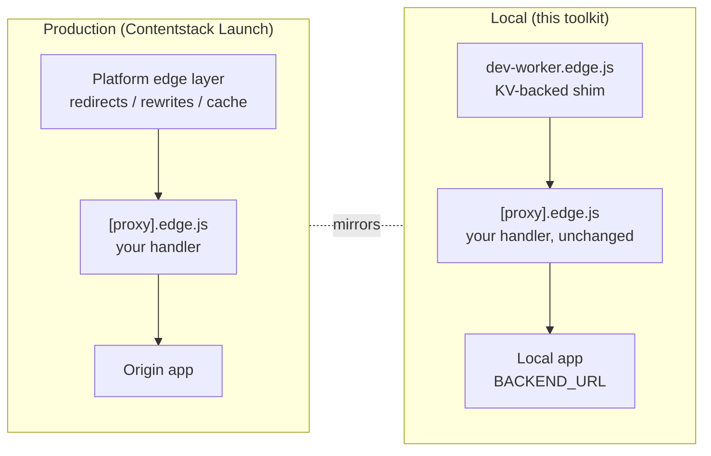
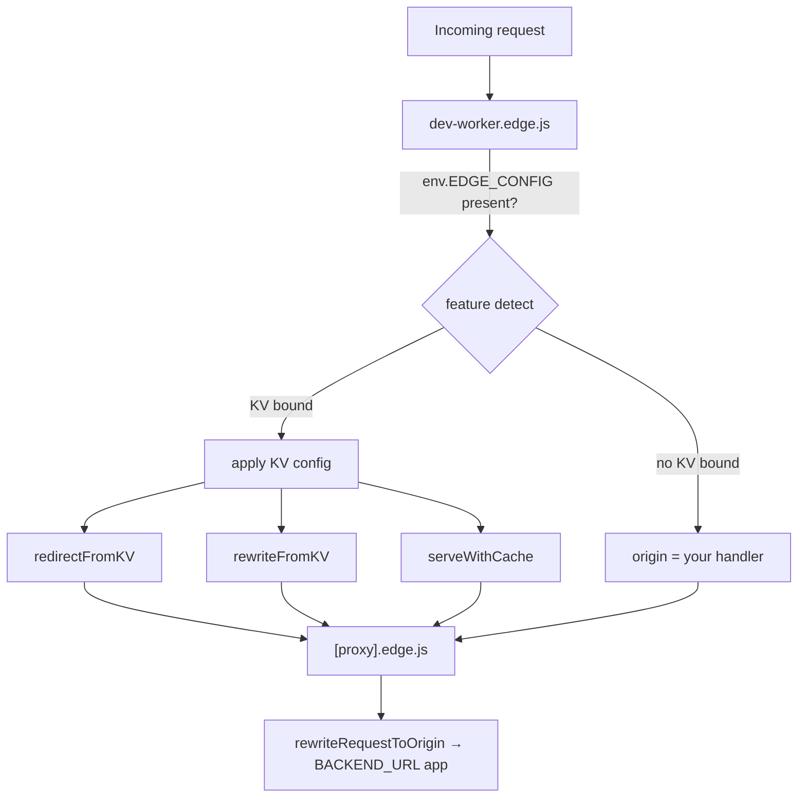
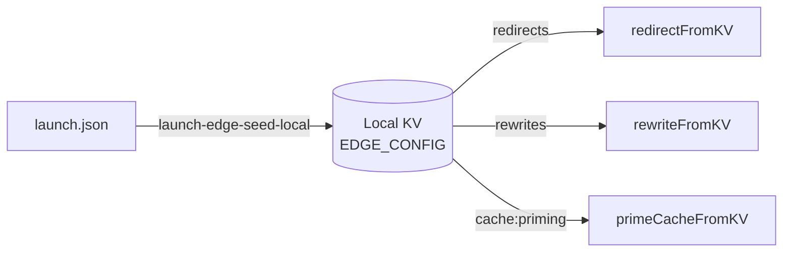
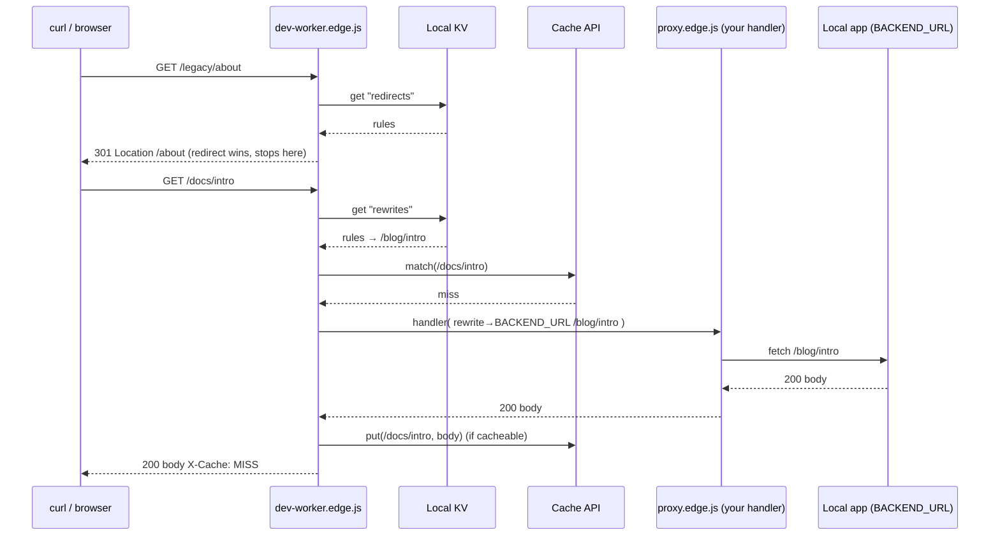
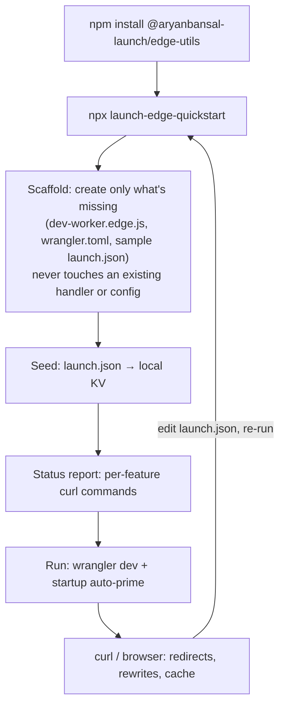
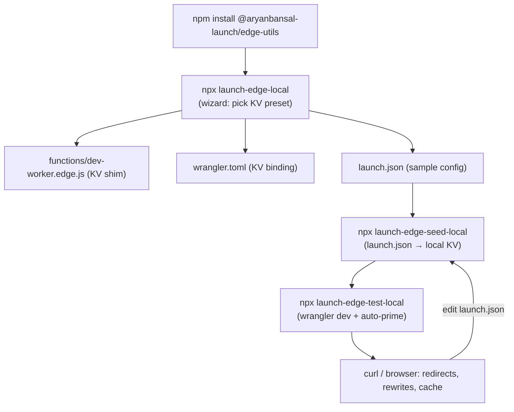

# Architecture — Local Edge Dev Setup

This document explains **how `@aryanbansal-launch/edge-utils` runs and tests
Contentstack Launch edge functions on your machine**, and in particular how it
simulates the Launch platform's **KV-backed config** (redirects, rewrites, and
cache priming) using Wrangler + Miniflare — with no Cloudflare account and no
deploy.

It is aimed at contributors and advanced users who want the full mental model,
not just the commands. For task-oriented steps see [readme.md](readme.md); for a
runnable project see [`examples/local-dev/`](examples/local-dev/).

---

## 1. The problem this solves

Contentstack Launch runs your edge function (`functions/[proxy].edge.js`) at the
edge, and applies **platform-level config** — bulk redirects, rewrites, and
cache priming from `launch.json` — *around* that function. In production that
config lives in a platform store and is applied by the platform; locally you
have neither the platform nor the store.

We want to reproduce that behavior on a laptop so you can **see redirects fire,
rewrites swap paths, and the cache warm up** before deploying. The strategy:

- Run the Workers runtime locally via **Wrangler → Miniflare**.
- Simulate the platform config store with a **local KV namespace** (also
  emulated by Miniflare).
- Read that config at request time with small, dependency-free **library
  helpers**, from a thin **dev-only shim** that wraps your real handler.



The key idea: **the shim plays the role of the platform layer locally**, so your
production handler stays untouched and production-safe.

---

## 2. Runtime substrate: Wrangler + Miniflare

- **Wrangler** is Cloudflare's Workers CLI. It is bundled as an
  `optionalDependency` of this package, so users don't install it separately.
- `wrangler dev` runs your worker on **Miniflare**, a Workers-compatible runtime
  that emulates the platform APIs **locally and offline**, including:
  - **KV namespaces** (`env.EDGE_CONFIG`)
  - the **Cache API** (`caches.default`)
  - `fetch`, `Request`/`Response`, `ctx.waitUntil`, etc.
- Miniflare persists KV/Cache state **to disk** so it survives restarts. We pin
  that location to `.wrangler-local/` (see §6).

No Cloudflare account, network, or deployed namespace is required for any of
this.

---

## 3. Component map

### Library source (`src/`)

| Module | Role |
|---|---|
| [src/kv/types.ts](src/kv/types.ts) | Minimal structural `EdgeKVNamespace` / `EdgeCache` interfaces — a subset of the real Workers types, so the library needs **no** `@cloudflare/workers-types` dependency. |
| [src/utils/match-rule.ts](src/utils/match-rule.ts) | Shared `source → destination` matcher (exact + trailing `/*` wildcard). Used by both redirects and rewrites. |
| [src/redirect/redirect-kv.ts](src/redirect/redirect-kv.ts) | `redirectFromKV` — reads the redirect table from KV, returns a redirect `Response` on match. |
| [src/rewrite/rewrite-kv.ts](src/rewrite/rewrite-kv.ts) | `rewriteFromKV` — reads the rewrite table from KV, returns a rewritten `Request` (path swapped, client URL unchanged). |
| [src/cache/priming.ts](src/cache/priming.ts) | `primeCache` / `primeCacheFromKV` (warm the Cache API) and `serveWithCache` (serve-or-populate with `X-Cache: HIT\|MISS`). |
| [src/launch/config.ts](src/launch/config.ts) | `LaunchConfig` types + `generateLaunchConfig` — the shape of `launch.json`. |
| [src/dev/rewrite-origin.ts](src/dev/rewrite-origin.ts) | `rewriteRequestToOrigin` — repoints a request at `BACKEND_URL` for local proxying. |

### CLI (`bin/`)

| Command (package bin) | Script | Role |
|---|---|---|
| `create-launch-edge` | [bin/launch-init.js](bin/launch-init.js) | Scaffolds `functions/`, `wrangler.toml`, and the **dev-worker shim**. Hosts the local wizard. |
| `launch-edge-local` | [bin/launch-edge-local.js](bin/launch-edge-local.js) | Shortcut for `create-launch-edge local` — the interactive preset wizard. |
| `launch-config` | [bin/launch-config.js](bin/launch-config.js) | Interactive editor for `launch.json` (redirects / rewrites / cache priming; CSV/JSON bulk import). |
| `launch-edge-quickstart` | [bin/launch-edge-quickstart.js](bin/launch-edge-quickstart.js) | **One command**: non-interactively scaffolds whatever's missing, seeds KV, prints a per-feature status report, then runs `launch-edge-test-local`. See §9. |
| `launch-edge-seed-local` | [bin/launch-edge-seed-local.js](bin/launch-edge-seed-local.js) | Loads `launch.json` into the **local KV** namespace. |
| `launch-edge-test-local` | [bin/launch-edge-test-local.js](bin/launch-edge-test-local.js) | Runs `wrangler dev` (pinned persist dir) and **auto-primes** the cache once ready. |
| `launch-help` | [bin/launch-help.js](bin/launch-help.js) | Prints usage/help. |

All scaffold file templates (the default handler, the KV-aware dev-worker shim, `wrangler.toml`, and the sample `launch.json`) live in one shared module, [bin/lib/scaffold-templates.js](bin/lib/scaffold-templates.js), imported by both `launch-init.js` and `launch-edge-quickstart.js` — so the auto-priming logic in the shim can't drift out of sync between the wizard path and the one-command path.

---

## 4. The two-layer worker model

This is the central design decision. There are **two** files in `functions/`:

1. **`[proxy].edge.js` — your real handler.** This is what deploys to Launch. It
   contains your logic (auth, geo, JSON routes, `fetch`/passthrough to origin).
   The toolkit **never bakes KV logic into this file** — so it behaves
   identically in production, where there is no KV binding.

2. **`dev-worker.edge.js` — the local-only shim.** This is the `main` entry in
   `wrangler.toml`. It is the Miniflare worker. It:
   - reads the simulated Launch config from KV,
   - applies redirects / rewrites / cache priming (the "platform layer"),
   - and delegates everything else to your `[proxy].edge.js` as the "origin".



### Feature detection

The shim's KV block is guarded by `if (env.EDGE_CONFIG)`. If no KV namespace is
bound (e.g. a non-KV preset, or a stripped-down config), the shim degrades to a
plain rewrite-to-origin dev worker — the pre-KV behavior. This guard is what
keeps the same generated code safe across setups.

---

## 5. Config source of truth: `launch.json` → KV

`launch.json` at the project root is the **single source of truth**, the same
file you deploy. It is produced/edited by `launch-config` (or a wizard preset)
and has this shape (empty sections are stripped):

```json
{
  "redirects": [
    { "source": "/legacy/about", "destination": "/about", "statusCode": 301 },
    { "source": "/old-shop/*",   "destination": "/shop/*",  "statusCode": 301 }
  ],
  "rewrites": [
    { "source": "/home",   "destination": "/" },
    { "source": "/docs/*", "destination": "/blog/*" }
  ],
  "cache": { "cachePriming": { "urls": ["/", "/about"] } }
}
```

`launch-edge-seed-local` reads this file and writes **three keys** into the
`EDGE_CONFIG` KV namespace — only for the sections that are present:

| `launch.json` section | KV key | Reader |
|---|---|---|
| `.redirects` | `redirects` | `redirectFromKV` / `loadRedirects` |
| `.rewrites` | `rewrites` | `rewriteFromKV` / `loadRewrites` |
| `.cache.cachePriming` | `cache:priming` | `primeCacheFromKV` / `loadCachePrimingUrls` |

Seeding uses `wrangler kv key put <key> --binding EDGE_CONFIG --local
--persist-to .wrangler-local --path <tmpfile>` (values passed by file to avoid
shell-escaping issues). Re-run it whenever you edit `launch.json`.



---

## 6. Local KV & Cache persistence

Both the seed step and the dev server must read/write the **same on-disk store**,
or the worker sees an empty KV. We pin both to `.wrangler-local/`:

- `launch-edge-seed-local` defaults `--persist-to .wrangler-local`.
- `launch-edge-test-local` defaults `--persist-to .wrangler-local` (a
  user-supplied `--persist-to` is respected and passed through unchanged).

On disk Miniflare lays it out as:

```
.wrangler-local/
  v3/
    kv/edge_config_local_placeholder/…   # seeded redirects / rewrites / cache:priming
    cache/…                              # Cache API entries (priming + serveWithCache)
```

`.wrangler-local/` and `.wrangler/` are git-ignored. The `id` in the
`[[kv_namespaces]]` binding is a **placeholder** — it only names the local store;
no real namespace exists.

---

## 7. Request lifecycle

For a KV-enabled setup, `dev-worker.edge.js` processes each request in this
order:

1. **`GET /__prime`** → run cache priming from KV and return a JSON report.
   (Convenience endpoint for manual warm-up; see §8.)
2. **First-request auto-prime** → on the very first request the worker serves,
   kick off priming in the background via `ctx.waitUntil` (once per worker
   lifetime).
3. **Redirects** → `redirectFromKV`. On a match, return `Response` (301/308/…)
   immediately. Exact and wildcard sources supported.
4. **Rewrites** → `rewriteFromKV`. On a match, produce a new `Request` with the
   path swapped (client URL unchanged); otherwise keep the original request.
5. **Serve through cache** → `serveWithCache` checks the Cache API; on a HIT it
   returns the cached response (`X-Cache: HIT`), on a MISS it fetches from the
   origin, stores a cacheable response, and returns it (`X-Cache: MISS`).

The "origin" for steps 2–5 is a function that runs **your** `[proxy].edge.js`
against the local app via `rewriteRequestToOrigin(req, BACKEND_URL)`.



### Matching semantics (`matchRule`)

- **Exact**: `source` equals the pathname.
- **Wildcard**: `source` ending in `/*` matches any pathname under that prefix.
  - Destination with `*` → the captured tail is substituted
    (`/old-shop/*` → `/shop/*` turns `/old-shop/a/b` into `/shop/a/b`).
  - Destination without `*` → **static catch-all**, tail dropped
    (`/drop/*` → `/gone` turns `/drop/x/y` into `/gone`).
- First matching rule (array order) wins.

---

## 8. Cache priming

Priming proactively fetches the URLs in `cache:priming` and stores cacheable
responses **before** real traffic arrives — so the first visitor gets a HIT
instead of paying the cold-origin cost. It runs three ways:

| Trigger | Where | When |
|---|---|---|
| **Startup (A)** | `launch-edge-test-local` | After Wrangler prints "Ready on …", the CLI fires one `GET /__prime`. Skip with `--no-prime`. |
| **First request (B)** | `dev-worker.edge.js` | Background prime (`ctx.waitUntil`) on the first served request, guarded by a once-flag. |
| **Manual** | `GET /__prime` | Any time, to re-warm. |

`primeCacheFromKV` fetches each URL through the same origin function used to
serve requests, keying the cache by the **public** URL (`keyBase = url.origin`)
so subsequent requests match. `primeCache` verifies retention with a follow-up
`cache.match` — so its `cached` flag reflects whether the Cache API **actually
kept** the entry, not merely that the fetch was 2xx.

> **Cacheability matters.** The Cache API only retains responses that are
> cacheable per HTTP semantics. A response with `Cache-Control: no-cache` (or an
> already-expired `max-age=0`) is dropped by `cache.put` — priming reports
> `cached: false` and requests stay `X-Cache: MISS`. This is correct behavior,
> and mirrors production: set proper `Cache-Control` on the routes you expect to
> cache.

---

## 9. End-to-end user flow

### One command (`launch-edge-quickstart`)

`launch-edge-quickstart` composes the three granular steps below into a single, non-interactive run:



```bash
npm install @aryanbansal-launch/edge-utils
npx launch-edge-quickstart     # scaffold (only what's missing) + seed + status report + run
```

It shells out to the same `launch-edge-seed-local.js` and `launch-edge-test-local.js` scripts described below (via `spawnSync`/`spawn`), so behavior — persist-dir pinning, `--no-prime`, argument passthrough — is identical to running them by hand. The only things it adds are: non-interactive scaffolding with existing-file protection, and a status report that reads `launch.json` and prints exactly what's configured per feature with ready-to-copy `curl` commands.

### Step-by-step (the granular commands)

Use these instead of `launch-edge-quickstart` when you want to pick a specific preset via the wizard, or want scaffold/seed/serve as separate, inspectable steps:



Concretely:

```bash
npm install @aryanbansal-launch/edge-utils
npx launch-edge-local          # scaffold: shim + wrangler.toml + sample launch.json
npx launch-edge-seed-local     # load launch.json into local KV
npx launch-edge-test-local     # wrangler dev (shared persist dir) + startup auto-prime
```

---

## 10. Production vs. local

| Concern | Production (Launch) | Local (this toolkit) |
|---|---|---|
| Config store | Platform-managed | Local KV (`EDGE_CONFIG`), seeded from `launch.json` |
| Where rules apply | Platform layer around your function | `dev-worker.edge.js` shim |
| Your handler | `[proxy].edge.js` | `[proxy].edge.js` (identical, untouched) |
| Cache priming trigger | Platform (post-deploy/purge) | Startup + first-request + manual `/__prime` |
| Runtime | Cloudflare Workers | Miniflare via `wrangler dev` |

**Fidelity is functional, not timing-accurate.** Local KV reads are immediate
and the Cache is in-process, so this does **not** reproduce real KV propagation
delay or edge cache tiering. It verifies config and logic, not consistency
timing.

---

## 11. Caveats & gotchas

- **Persist dir must match.** Seed and dev both default to `.wrangler-local`; if
  you override one, override both, or the worker reads an empty KV.
- **Cacheability.** See §8 — no `Cache-Control`, no cache retention.
- **`caches` global.** Available at runtime in Miniflare; the generated
  `dev-worker.edge.js` uses `caches.default`. TS tooling may need a declaration.
- **Wizard on an existing handler.** If `functions/[proxy].edge.js` already
  exists, the wizard prompts before overwriting — decline to keep your handler
  (the KV logic lives in the shim regardless).
- **Compression in tests.** `wrangler dev` may gzip responses; use
  `curl --compressed` to read bodies, `curl -i` to inspect redirect headers.

---

## 12. Directory reference

```
launch-edge-utils/
├── bin/
│   ├── launch-init.js            # scaffolder + wizard + file templates
│   ├── launch-edge-local.js      # → launch-init local
│   ├── launch-config.js          # launch.json editor
│   ├── launch-edge-seed-local.js # launch.json → local KV
│   ├── launch-edge-test-local.js # wrangler dev + auto-prime
│   └── launch-help.js
├── src/
│   ├── kv/types.ts               # EdgeKVNamespace / EdgeCache interfaces
│   ├── utils/match-rule.ts       # exact + wildcard matcher
│   ├── redirect/redirect-kv.ts   # redirectFromKV
│   ├── rewrite/rewrite-kv.ts     # rewriteFromKV
│   ├── cache/priming.ts          # primeCache / primeCacheFromKV / serveWithCache
│   ├── dev/rewrite-origin.ts     # rewriteRequestToOrigin
│   └── launch/config.ts          # LaunchConfig / generateLaunchConfig
├── examples/local-dev/           # runnable reference project (see its README)
└── (scaffolded in a user project)
    ├── functions/[proxy].edge.js     # your handler (production)
    ├── functions/dev-worker.edge.js  # local KV shim (dev only)
    ├── wrangler.toml                 # KV binding + BACKEND_URL
    ├── launch.json                   # config source of truth
    └── .wrangler-local/              # Miniflare KV + Cache state (git-ignored)
```

---

## Summary

The local setup mirrors Launch's production model by splitting responsibilities:
your **handler stays production-pure**, a **dev-only shim** plays the platform's
config layer, **`launch.json` seeded into a Miniflare KV** is the config source
of truth, and the **Cache API** (with automatic priming) reproduces edge
caching. The result is a faithful, offline way to see redirects, rewrites, and
cache priming behave before you deploy.
